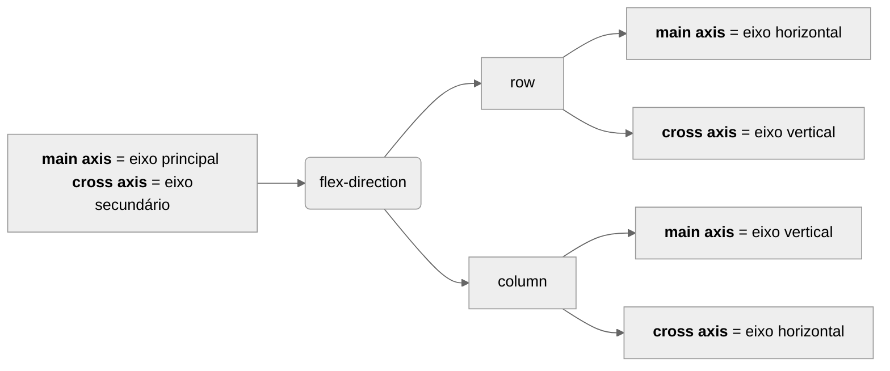

## FastAPI with React

Start FastAPI app
```
uvicorn main:app --reload
```

Create new project app in React
```
npx create-react-app finance-app
```

Start app
```
cd finance-app
npm start
```

Install dependence and libs
```
npm install axios
```


## JS Essential


start project
```sh
# set name and select type
npm create vite@latest
```

Clean project
```sh
# delete all content in main.js
rm style.css javascript.svg counter.js
```

Execute how dev
```
npm run dev
```


### Nullish Coalescing Operator ??
Operador para lidar com valors nulos

```js

const idade = 0;

// operador OR ||, temos um problema, 0, '', [], false, undefined, null  => false, valores nao validos
// assim utilizamos ?? no lugar do || para uma operacao valida
document.body.innerText = 'Sua idade é: ' + (idade ?? 'Não informado');

```


### Objetos


```js
// Objetos

const user = {
  name: 'Weslley',
  idade: 29,
  address: {
    street: 'Rua Abacate',
    numer: 174
  },
};


// elemento existe no objeto
document.body.innerText = ('name' in user)

// mostrar chaves e valores
document.body.innerText = Object.keys(user)
document.body.innerText = Object.values(user)
document.body.innerText = JSON.stringify(Object.values(user))

// vetor com vetores dentro, [[chave, valor]]
document.body.innerText = JSON.stringify(Object.entries(user))
```

### Desestruturação


```js
// Desestruturação

const user = {
  name: 'Weslley',
  idade: 29,
  address: {
    street: 'Rua Abacate',
    numer: 174
  },
};


const address = user.address
// forma similar a superior utilizando desestruturação
const { address } = user
document.body.innerText = JSON.stringify({address})


// desestruturacao permite acessar mais elementos do objeto
const { address, idade } = user
document.body.innerText = JSON.stringify({address, idade})


// renomendo nome da variavel idade para age
const { address, idade: age } = user
document.body.innerText = JSON.stringify({address, age})


// setando valor default caso variavel não exista no objeto
const { address, idade: age, nickname = 'Almeida' } = user
document.body.innerText = JSON.stringify({ address, age, nickname })


// a destruturação pode ser utilizado em qualquer lugar onde tem referência para um objeto

function mostraIdade(user) {
  return user.idade;
}
document.body.innerText = mostraIdade(user)


//capturamos apenas a chave idade do objeto user
function mostraIdade({ idade }) {
  return idade;
}
document.body.innerText = mostraIdade(user)
```


### Rest operator


```js

// utilizado para acessar o resto das informacoes que sobram da desestruturação
const user = {
  name: 'Weslley',
  idade: 29,
  address: {
    street: 'Rua Abacate',
    numer: 174
  },
};

const { name, idade,  ...rest } = user;
document.body.innerText = JSON.stringify(rest)


// podemos utilizar o rast em arrays
const array = [1, 2, 3, 4, 5, 6, 7, 8, 9, 10]

// destruturacao sao similares
// const first = array[0];
// const second = array[1];
const [first, second] = array;


// destruturacao com rest operator
const [first, second, ...restante] = array;
document.body.innerText = JSON.stringify(restante)

// quero capturar o primeiro e o terceiro
const [first, ,third, ...restante] = array;
document.body.innerText = JSON.stringify({first, third, restante})
```

### Short Syntax


```js
// Short Syntax
// utiliza o nome da variavel como chave para o objeto
const name = 'Weslley';
const age = 27;

// const user = {
//   name: name,
//   age: idade,
// };
// short syntax transform modo acima igual ao debaixo
const user = {
    name,
    age,
  };

document.body.innerText = JSON.stringify(user)
```

### Optional Chaining


```js
const user = {
  name: 'Weslley',
  age: 29,
  address: {
    street: 'Rua Abacate',
    numer: 174
  },
};


document.body.innerText = user.address.street

quando tento acessar uma propriedade que pode não existir, precisamos tratar esse erro
document.body.innerText = user.address ? user.address.street : 'Não informado'

```
mas o exemplo acima tem um problema para o seguinte caso

```js
const user2 = {
  name: 'Weslley',
  age: 29,
  address: {
    street: 'Rua Abacate',
    numer: 174,
    zip: {
      code: '78945000',
      city: 'Abacate City',
    },
  },
};

fazer o tratamento vai ser complicado, devido o aninhamento
document.body.innerText = user2.address
 ? user2.address.zip 
  ? user2.address.zip.code
  : 'Não informado'
: 'Não informado'


// outra forma de escrever o código acima é da seguinte forma
// unindo optional chaining e Nullish Coalescing
document.body.innerText = user2.address?.zip?.code ?? 'Não informado'
```

Utilizando com funções

```js
const user3 = {
  name: 'Weslley',
  age: 29,
  address: {
    street: 'Rua Abacate',
    numer: 174,
    zip: {
      code: '78945000',
      city: 'Abacate City',
    },
    // showFullAddress() {
    //   return 'ok';
    // }
  },
};

// verifica existência da função showFullAddress
document.body.innerText = user3.address?.showFullAddress?.()
```


```js

// Optional Chaining

const user = {
  name: 'Weslley',
  age: 29,
  // address: {
  //   street: 'Rua Abacate',
  //   numer: 174,
  //   zip: {
  //     code: '78945000',
  //     city: 'Abacate City',
  //   },
  //   showFullAddress() {
  //     return 'ok';
  //   }
  // },
};

const key = 'state';
// verifica existência da função
document.body.innerText = user.address?.[key]

```


### Métodos de Array

#### Map


```js
const array= [1, 2, 3, 4, 5];

// for tradicional
for (const i of array) {
  document.body.innerText += i
}

// forEach não é bom para percorrer e aplicar uma ação dentro do array
array.forEach(item => {
  document.body.innerText += item
})
```


```js
// map sempre retorna um novo array do tamanho do original
const novoArray = array.map(item => {
  return item * 2
})

document.body.innerText = JSON.stringify(novoArray)


// verificar paridade
const novoArray = array.map(item => {
  if (item % 2 === 0) {
    return item * 10;
  }
  return item;
});

document.body.innerText = JSON.stringify(novoArray)
```


#### Filter

Sempre retorna uma lista dos elementos filtrados

```js
const array = [1, 2, 3, 4, 5];

// igual ==== diferente !==
const novoArray = array.filter(item => item % 2 !== 0)
document.body.innerText = JSON.stringify(novoArray)


const novoArray = array
  .filter(item => item % 2 !== 0)
  .map(item => item * 10)

document.body.innerText = JSON.stringify(novoArray)
```

#### Every
Retorna um booleano a partir da consulta aplicada na array

```js
const array = [1, 2, 3, 4, 5, 'abacate'];

// mesmo objetivo
// const todosItensSaoNumeros = array.every(item => typeof item === 'number')
const todosItensSaoNumeros = array.every(item => {
  return typeof item === 'number'
})

document.body.innerText = JSON.stringify(todosItensSaoNumeros)
```

#### Some

Algum elemento é XPTO, retorna booleano
```js

const array = [1, 2, 3, 4, 5, 'abacate'];

const peloMenosUmItemNaoUmNumero = array.some(item => {
  return typeof item === 'number';
})

document.body.innerText = JSON.stringify(peloMenosUmItemNaoUmNumero)
```


#### Find

Retorna o primeiro elemento que tenha match com a condição, caso nenhum elemento da array satisfasa será retornado undefined.


```js
const array = [1, 2, 3, 4, 5, 'abacate'];

const par = array.find(item => {
  return item % 2 === 0;
})

document.body.innerText = JSON.stringify(par)
```

#### findIndex

Retorna o ínidice do primeiro elemento que tenha match com a condição, caso nenhum elemento da array satisfasa será retornado undefined.


```js
const array = [1, 2, 3, 4, 5, 'abacate'];

const parIndex = array.findIndex(item => {
  return item % 2 === 0;
})

document.body.innerText = JSON.stringify(parIndex)
```

#### Reduce
Utilizado para criar uma nova estrutura de dados baseado no array.


```js
const array = [1, 2, 3, 4, 5];

// accumulator e objeto
document.body.innerText = 'acc, item \n'
const soma = array.reduce((acc, item) => {
  document.body.innerText += acc + ' ,' + item + '\n'

  // reduce espera o novo return do acc
  return acc + item
}, 0)

document.body.innerText = JSON.stringify(soma)
```


### Template Literals

```js
// const name = 'Weslley';
const name = null;
const message = `Bem-vindo, ${name ? name : 'visitante'}`;
document.body.innerText = message
```

### Promises
Precisamos que algumas ações da nossa aplicação seja assíncrona, seus princípais métodos são 
then, catch, finally, async e await.

- then: recebe o response de sucesso
- catch: trata o erro
- finally: após finalizado o promise ele atua, independente do resultado.

Exemplo básico
```js
// dessa forma é uma funcao
const somaDoisNumeros = (a, b) => {
  return new Promise((resolve, reject) => {
    setTimeout(() => {
      reject(a + b);
    }, 2000);
  });
}

// then recebe operação válida, catch trata o erro
somaDoisNumeros(2, 3)
  .then(soma => {
    document.body.innerText = soma
  })
  .catch(err => {
    console.log(err)
  })
```


Exemplo utilizando fetch

```js

fetch('https://api.github.com/users/weslleyalmeid')
  .then(response => {
          response.json ().then(body => {
          console.log(body);
        })
  })
  .catch(err => {
    console.log(err)
  })

// codigo anterior melhorado, utilizado multiplos .then

fetch('https://api.github.com/users/weslleyalmeid')
  .then(response => {
    return response.json()
  })
  .then(body => {
    console.log(body)
  })
  .catch(err => {
    console.log(err)
  })
  .finally(console.log('Finalziado')
```

Incluindo finally


```js
fetch('https://api.github.com/users/weslleyalmeid')
  .then(response => {
    return response.json()
  })
  .then(body => {
    console.log(body)
  })
  .catch(err => {
    console.log(err)
  })
  .finally(() => {
    console.log('Finalizado')
  })
```

Refatorando código anterior e utilizando async e await
```js

async function buscaDadosNoGithub(){
  try {
    const response = await fetch('https://api.github.com/users/weslleyalmeid');
    const body = await response.json();
  
    console.log(body)
  } catch (err) {
    console.log(err)
  } finally {
    console.log('Finalizado')
  }

}

buscaDadosNoGithub();
```

Acessar elemento de promisses
```js
async function buscaDadosNoGithub(){
  try {
    const response = await fetch('https://api.github.com/users/weslleyalmeid');
    const body = await response.json();
  
    return body.name;
  } catch (err) {
    console.log(err)
  } finally {
    console.log('Finalizado')
  }
}

// necessario, pois todo retorno de uma classe async é uma Promise
buscaDadosNoGithub().then(name => {
  console.log(name)
})

```


### ES Modules

Named Export, quando importamos como o nome da função ou variável.
Default, é possível renomear o nome da função

./lib/math.js
```js
export const PI = Math.PI

export function soma(a, b){
    return a + b
}


export function sub(a, b){
    return a - b
}
```

./lib/sum.js
```js
export default function sum(a, b){
    return a + b
}
```

```js

import { soma, sub, PI } from "./lib/math";
import abacate from "./lib/sum";

// named export, preferível
console.log(soma(10, 20))
console.log(sub(10, 20))
console.log(PI)

// default
console.log(abacate(10, 20))

```

Importando todos os métodos
```js
import * as math from "./lib/math";

console.log(math)

```

usando alias
```js
import {soma as sum} from "./lib/math";

console.log(sum(1, 2))

```

export uma lib externa em outro arquivo, muito raro de ser utilizado
```js
// ajustado o arquivo sum.js com o seguinte código
export { soma } from './math';

// importando no main.js
import { soma } from "./lib/sum";
console.log(soma(1, 2))
```


## APRENDA REACT EM 2 HORAS - 
Matheus Battisti - Hora de Codar

### Image

```js
// dentro do assets
import imagem2 from "../assets/img2.jpg"

const Images = () => {

    return (
        <div>
            {/* procura no public */}
            
            
        </div>
    );
};

export default Images;
```

### Hooks
Capturam o evento, trata e renderiza o novo valor


#### useState

O userState permite gerenciar o estado de um componente funcional.

O hook useState retorna um array de duas propriedades:

- **state:** o valor atual do estado.
- **setState:** uma função que pode ser usada para atualizar o estado.

Basicamente trata uma variável, que, toda vez que troca de valor a tela irá "recarregar os novos valores".

```js
import { useState } from "react";

// consultar, alterar, sempre utilizar dessa forma
const [novaIdade, setNovaIdade] = useState(40);

const changeNewAge = () => {
    setNovaIdade(45);
}

<p>Idade: {novaIdade}</p>
<button onClick={changeNewAge}>Mudar idade</button>
```

#### useEffect

O hook useEffect permite executar efeitos colaterais em um componente funcional. Efeitos colaterais são operações que podem afetar o estado do DOM ou do sistema operacional.

Toda vez que a variável movies sofrer uma ação, o useEffect irá executar esse script.

```js
  useEffect(() => {
    if (movies && movies.length > 0) {
      aveMovies(movies)
    }

  }, [movies])

```

#### useRef

O hook useRef permite acessar um elemento DOM ou um valor de estado de maneira segura.

O input ao sofrer uma ação, por meio do onChange direciona para a function que por sua vez, executa uma tarefa, inclusive utilizando o hook useRef para acessar o valor do elemento passado atráves do input.

```js
const input = useRef()


function inputChange() {
  const newMovies = movies.filter(movie =>
    movie.name.toLowerCase().includes(input.current.value.toLowerCase())
  )

  aveMovies(newMovies)
  setFilteredMovies(newMovies)
}


<div className='ave-values'>

  <div>
    <p>Ave. movie runtime: {aveValues.runtime} min</p>
    <p>Ave. movie budget: ${aveValues.budget}M</p>
  </div>
  <input placeholder='Filter movies by name' ref={input} onChange={inputChange} />
</ div>


```

### Looping

```js
const List = () => {
    const items = [
        {
            id: 1,
            name: "Matheus",
        },
        {
            id: 2,
            name: "João",
        },
        {
            id: 3,
            name: "Pedro",
        }
    ];

    return <div>
        {items.map((item) => (
            <p key={item.id}>{item.id} - {item.name}</p>
        ))}
    </div>
}

export default List;
```


### Renderização condicional

```js
const RenderCond = () => {

    const x = 12;
    const y = 10;

    return (
    <div>
      {x > 5 && <p>X é maior que 5</p>}
      {x > y ? <p>{x} é maior que {y}</p> : <p>{x} é não é maior que {y}</p>}
    </div>
    );
};

export default RenderCond;
```

### Props

Recebe o atributo como método do objeto props
```js
// Props.js
const Props = (props) => {
    const y = 10;

    return (
    <div>
      {props.x > 5 && <p>X é maior que 5</p>}
      {props.x > y ? <p>{props.x} é maior que {y}</p> : <p>{props.x} é não é maior que {y}</p>}
    </div>
    );
};

export default Props;


// App.js
<Props  x={10} />
```

Utilizando props com desestruturação
```js
const Props = ({ x, y }) => {
  // const Props = (props) => { 

    return (
    <div>
      {x > 5 && <p>X é maior que 5</p>}
      {x > y ? <p>{x} é maior que {y}</p> : <p>{x} é não é maior que {y}</p>}

    </div>
    );
};


// App.js
<Props  x={10} y={20} />
```


### Fragments

Possibilita trabalhar com elementos sem a necessidade de elementos pai.

```js
const Fragments = ({ x }) => {
      return (
        <>
            <p>Primeiro</p>
            <p>Segundo</p>
            <p>Terceiro</p>
        </>
      );
  };
  
  export default Fragments;

```

## React


- Os elementos sempre precisam ter um elemento pai. Isso é porque os elementos React precisam ser renderizados dentro de um componente.
- O código deve ser organizado em componentes pequenos e reutilizáveis. Isso torna o código mais fácil de entender e manter.
- Use os hooks do React para gerenciar estado e efeitos colaterais. Os hooks tornam o código mais conciso e legível.


## ToDo em React

Instalação de novos plugins

```js
 npm install json-server react-icons
```

O index.css é o css global da aplicação
```css
html {
  background: linear-gradient(
    195deg,
    rgba(240, 98, 146, 1) 0%,
    rgba(221, 89, 133, 1) 98%
    );
}


body {
  margin: 0;
  padding: 0;
  font-family: Helvetica;
}
```


App.js é onde centraliza todo o código da aplicação


## Preact e Tailwind

```sh
npm init vite@latest
cd preact-tailwind
npm install

# https://tailwindcss.com/docs/guides/vite
npm install -D tailwindcss postcss autoprefixer
npx tailwindcss init -p
npm run dev
```

Criar o Signals no signals/store.js
```js
import { signal } from "@preact/signals";

export const count = signal(0);

```
para adicionar no projeto

```sh
npm install @preact/signals
```

adicionar nanoid para gerar id randomicas

```sh
npm i nanoid
```


## Flex Box

Exemplo de utilização do flex, lembrando que para utilizar as propriedades do flex é necessário que o display esteja atribuido o valor de flex. 

### Flex Contêiner (Coletivo, Plural)
Atua sobre elementos aninhados. Os comandos mais utilizados são **flex-direction, justify-content, align items** e gap.

#### flex-direction
Tem as opções row, columns, column-reverse e row-reverse
```css
div {
    background: rgb(135, 135, 135);
    width: 100%;
    height: 100%;
    padding: 20px;
    display: flex;
    /* por padrao flex e row */
    flex-direction: row;
    /* flex-direction: column; */
    /* flex-direction: column-reverse; */
    /* flex-direction: row-reverse; */
}
```

#### flex-wrap

Define a quebra de linha, nowarp, wrap e wrap-reverse. Muito importate saber utilizar para não quebrar o layout


```css
div {
    background: rgb(135, 135, 135);
    width: 100%;
    height: 100%;
    padding: 20px;
    display: flex;
    /* por padrao flex e row */
    flex-direction: row;
    /* por padrao nowrap */
    flex-wrap: wrap;
}
```

#### flex-flow

Unificação do flex direction + wrap
```css
div {
    background: rgb(135, 135, 135);
    width: 100%;
    height: 100%;
    padding: 20px;
    display: flex;
    /* flex-flow: direction wrap */
    flex-flow: row wrap;
}
```

#### justify-content

Vai realizar o alinhamento dos itens no eixo principal, a definição do eixo principal é baseado no flex-direction row ou column.



as principais são as seguintes

- **flex-start:**	Alinha os elementos no início do container, deixando o espaço livre no final
- **flex-end:**	Alinha os elementos no final do container, deixando o espaço livre no início
- **center:**	Centraliza os elementos no container
- **space-between:**	Espaça uniformemente os elementos entre si, deixando o mesmo espaço livre nas extremidades do container
- **space-around:**	Espaça uniformemente os elementos entre si, deixando o mesmo espaço livre nas extremidades e no centro do container
- **space-evenly:**	Espaça uniformemente os elementos entre si, deixando o mesmo espaço livre entre todos os elementos


```css
div {
    background: rgb(135, 135, 135);
    width: 100%;
    height: 100vh;
    padding: 20px;
    display: flex;
    flex-direction: row;
    justify-content: center;
}
```

#### align-items

Responsável por alinhar os itens no eixo secundário, tem os mesmos atributos do justify-content.

```css
div {
    background: rgb(135, 135, 135);
    width: 100%;
    height: 100vh;
    padding: 20px;
    display: flex;
    flex-direction: row;
    /* eixo principal */
    justify-content: center;
    /* eixo secundario */
    align-items: flex-end;
}
```

#### align-content

Responsável por alinhar os itens no eixo secundário, muito parecido 

- **align-items:** controla como os elementos flexíveis são alinhados ao longo do eixo transversal do container. O eixo transversal é o eixo perpendicular ao eixo principal.

- **flex-start:** alinha os elementos no topo do container, deixando o espaço livre no fundo.

- **flex-end:** alinha os elementos no fundo do container, deixando o espaço livre no topo.

- **center:** centraliza os elementos no container.

- **stretch:** estica os elementos para preencher o container, ignorando as alturas definidas.

- **baseline:** alinha os elementos com a baseline dos seus conteúdos.

#### gap

A propriedade gap define **o espaço entre os elementos flexíveis** em um container. O espaço é aplicado ao longo do eixo transversal do container, que é o eixo perpendicular ao eixo principal.

- A propriedade gap só é aplicada se o container tiver uma largura ou altura definida.
- A propriedade gap não é aplicada se os elementos flexíveis forem do mesmo tamanho.


### Flex Items (Individual, Singular)

Atua nos items do container.

#### flex-basis

O atributo flex-basis define o tamanho inicial do elemento flexível. O tamanho inicial é usado como base para o cálculo do tamanho do elemento quando o container tem espaço suficiente ou insuficiente. Por exemplo, você pode usar o atributo flex-basis para garantir que um elemento flexível tenha sempre uma largura ou altura mínima.

```css
section {
    background: rgb(147, 1, 191);
    /* width: 300px; */
    /* height: 300px; */
    margin: 10px;
    border: 2px solid black;
    padding: 10px;
    color: white;
    border-radius: 5px;
    flex-basis: 240px;
}
```


#### flex-grow

O atributo flex-grow é útil para controlar como o elemento flexível deve crescer se o container tiver espaço livre. Por exemplo, você pode usar o atributo flex-grow para garantir que um elemento flexível ocupe sempre a mesma largura ou altura, mesmo se o tamanho do container mudar.

No exemplo abaixo, até 200px crescem iguais, após 200px o .b2 crescre 2 vezes mais do que o .b1.
```css
.b1 {
    flex-grow: 1;
    width: 200px;
}

.b2 {
    flex-grow: 2;
    width: 200px;
}
```

#### flex-shrink

O atributo flex-shrink é útil para controlar como o elemento flexível deve encolher se o container tiver espaço insuficiente. Por exemplo, você pode usar o atributo flex-shrink para garantir que um elemento flexível não ocupe mais espaço do que o necessário, mesmo se o tamanho do container diminuir.

#### flex

Flex é um atalho para flex-basis + flex-grow + flex-shrink

#### order

O atributo order é útil para controlar a ordem de exibição dos elementos flexíveis. Por exemplo, você pode usar o atributo order para colocar um elemento flexível específico no início ou no final de um container.

#### align-self

O atributo align-self define como o elemento flexível deve ser alinhado ao longo do eixo transversal do container. O atributo align-self tem o mesmo efeito que a propriedade align-items, mas só é aplicado a um elemento flexível específico.

## Grid CSS

O CSS Grid é uma propriedade CSS que permite a criação de layouts de grade bidimensionais. Ele é usado para dividir um elemento pai em linhas e colunas, nas quais os elementos filhos podem ser posicionados.

O CSS Grid é uma alternativa ao layout flexbox, que é mais adequado para layouts unidimensionais. O CSS Grid é mais flexível e poderoso, permitindo a criação de layouts mais complexos e personalizados.

Os principais atributos do CSS Grid são:

- **display:** define o elemento como uma grade.
- **grid-template-columns:** define as colunas da grade.
- **grid-template-rows:** define as linhas da grade.
- **grid-column-start:** define a coluna inicial do elemento.
- **grid-column-end:** define a coluna final do elemento.
- **grid-row-start:** define a linha inicial do elemento.
- **grid-row-end:** define a linha final do elemento.
- **grid-template-areas** define as áreas da grade. Ela é usada para posicionar os elementos filhos em uma grade de forma mais fácil e intuitiva.


## Facebook com Tailwindcss

### Adicionar cor personalizada

adicione o colors no arquivo tailwind.config.js e para utilizar com texto bata utilizar text-blue-facebook

```js
/** @type {import('tailwindcss').Config} */
module.exports = {
  content: ["./src/**/*.{html,js}"],
  theme: {
    extend: {
      colors: {
        "blue-facebook": "#1877F2"
      }
    },
  },
  plugins: [],
}
```


## Projeto + Responsividade

- Pensar todos os elementos dentro de caixas, isso irá facilitar com os styles
- Elementos dinâmicos na tela, caso queira travar quantidades a serem mostradas, grid é uma boa escolha
- Mostrar elementos na tela baseado em ações, sempre utilizar os Hooks apropriados
- Criar breakpoints.js para padronizar pontos de quebra
- Lembrar que @media no css é estilo em cascata, é necessário colocar aninhado ao tag de interesse e abaixo do código css
- os breakpoints são setados do maior para o menor no @media bg > md > sm